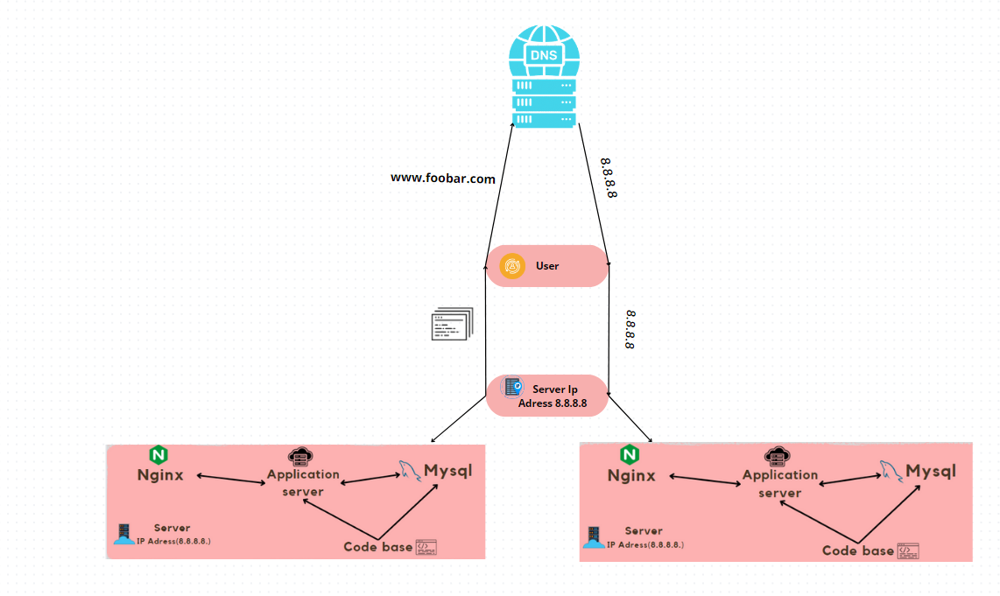

# ***Detailed Explanation of the Infrastructure***

### _1. Distribution Algorithm of the Load Balancer_

**Algorithm: Round Robin**
+The Round Robin algorithm cycles through each server behind the load balancer in a sequential manner, distributing incoming requests evenly. Each server gets a turn to handle a request, according to its weight, if weights are assigned. This ensures a fair distribution of load, keeping the processing time balanced across all servers.
Benefits: Smooth and equitable distribution of requests, adaptable to dynamic changes in server weights, which can be adjusted in real-time based on server performance or capacity.
### _2. Setup Enabled by the Load Balancer_

**Configuration: Active-Passive**
All nodes handle requests simultaneously, providing higher throughput and better response times. This setup improves load distribution and redundancy, but is more complex to manage.
Active-Passive Setup: One node (active) handles all the requests while the other node(s) (passive) are on standby. The passive node becomes active if the primary node fails. This setup is simpler and provides failover capabilities but may underutilize resources.
### _3. How a Database Primary-Replica (Master-Slave) Cluster Works_

Primary Node: Handles all write operations and propagates these changes to the Replica node. It can also handle read operations, but primarily deals with writes.
Replica Node: Primarily handles read operations, reducing the load on the Primary node. It synchronizes with the Primary node, receiving updates whenever a write operation is executed on the Primary.
Synchronization: Achieved through log-based replication or synchronous replication, ensuring data consistency between Primary and Replica nodes.
### _4. Difference Between the Primary Node and the Replica Node_

Primary Node:
Handles both read and write operations.
Critical for data integrity and availability of write operations.
Replica Node:
Handles only read operations.
Offloads read traffic from the Primary node, enhancing read performance and availability.
# ***Issues with This Infrastructure***
### _1. Single Points of Failure (SPOF)_
**Primary MySQL Database Server:**
 If it fails, write operations cease, affecting data integrity and updates.
Load Balancer: If it fails, no traffic can be routed to the web and application servers, making the website inaccessible.
Application Server: If the single application server fails, the dynamic content generation stops, affecting website functionality.
### _2. Security Issues_
**Lack of Encryption (SSL/TLS):**
 Data transmitted over the network is not encrypted, making it vulnerable to interception and attacks (e.g., Man-in-the-Middle attacks).
No Firewall: Absence of a firewall exposes the servers to unauthorized access and attacks. There's no mechanism to block malicious IP addresses or limit access to necessary ports and services.
### _3. No Monitoring_
**Server Status:**
 Without monitoring tools, there's no way to track the health, performance, or failures of the servers. This makes it difficult to detect issues proactively or respond promptly to outages or performance degradation.
