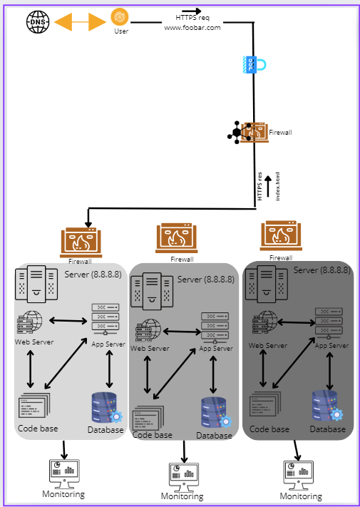

# ***_Detailed Explanation of the Infrastructure_***
### Load Balancer (LB):
Distributes incoming traffic across multiple web servers (Web1, Web2, Web3) for improved performance and redundancy.
### Firewalls (FW1, FW2, FW3):
 These act as security gates, filtering incoming and outgoing traffic based on predefined rules. They block malicious traffic and protect the infrastructure.
### Web Servers (Web1, Web2, Web3):
 Store and deliver website content (HTML, CSS, JavaScript) upon receiving requests from the load balancer.
### Application Servers (App1, App2, App3):
 (May be collocated with Web Servers) Handle dynamic website functionality and interact with the database.
### Database Server (DB1):
 Stores website data. This specific setup has DB1 configured as the primary server for writes and a read replica for handling read requests.
### Monitoring Clients (Mon1, Mon2, Mon3):
 These are agents installed on each server that collect performance data (CPU, memory, disk usage) and application logs. This data is then sent to a monitoring service (like Sumologic) for analysis.
# ***_Security and Encryption:_***

### SSL Certificate:
A single SSL certificate is installed on the load balancer, enabling HTTPS for secure communication between users and the website. This encrypts data in transit, protecting sensitive information.
### Monitoring:

Monitoring clients installed on each server collect data on resource usage, application performance, and system logs.
This data is sent to a monitoring service where it's analyzed for potential issues like slow response times or errors.
### Monitoring QPS (Queries Per Second):

To monitor QPS, the monitoring tool needs to track database calls. This can be achieved by instrumenting the application code to capture the number of database queries executed within a specific timeframe.
# ***_Issues with this Infrastructure:_***

### SSL Termination at Load Balancer:
While terminating SSL at the load balancer offers some security benefits, it can limit visibility into individual server certificates and make it harder to troubleshoot SSL-related issues on specific web servers.
Single Writeable MySQL Server: Having only one server capable of accepting writes creates a single point of failure. If DB1 fails, the website becomes unavailable for updates. Implementing a master-slave replication setup with automatic failover to a secondary server is recommended.
### Monolithic Servers:
Having all components (database, web server, application server) on the same servers can lead to resource contention. If a sudden surge in traffic overwhelms the web server, it can also impact database performance. Consider separating these functionalities onto dedicated servers for improved scalability and performance.