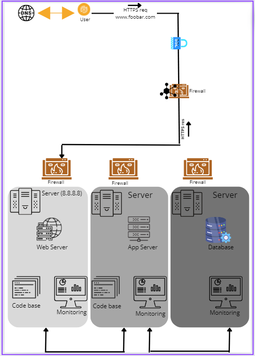

# ***_Specifics About This Infrastructure_***
The addition of a firewall between each server.
This protects each server from unwanted and unauthorized users rather than protecting a single server.
# ***_Issues With This Infrastructure_***
High maintenance costs.
Moving each of the major components to its own server, means that more servers would have to be bought and the company's electricity bill would rise along with the introduction of new servers. Some of the company's funds would have to be used to buy the servers and pay for the electricity consumption needed to keep the servers (including the new and old ones) running.
